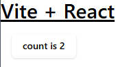

# Tailwind CSS v4 環境に shadcn/uiをインストールする手順

## はじめに

[Tailwind CSS v4](https://tailwindcss.com/blog/tailwindcss-v4)がリリースされました。さっそく[shadcn/ui](https://ui.shadcn.com/)をインストールしてみましたが、インストール時のチェックでエラーとなり失敗しました

Tailwind CSS v4では、インストールプロセスや必要なファイルが簡素化されましたが、shadcn/uiがそれに追随できていないためでした

そこで、shadcn-uiの[discattionページ](https://github.com/shadcn-ui/ui/discussions/2996#discussioncomment-11949859)を参考に、インストール手順(チェックの回避手順)をまとめました

（正式に対応するまでは`Tailwind CSS v3`系を使った方が良いと思います）

## tailwind CSS4のインストール

手順に従い、Vite環境にtailwind v4をインストールします

https://tailwindcss.com/docs/installation/using-vite


```bash
npm create vite@latest tailwind4-shadcn -- --template react-swc-ts
cd tailwind4-shadcn
npm install
npm install tailwindcss @tailwindcss/vite
```

* `vite.config.ts`にプラグインを追加します

```diff
import { defineConfig } from 'vite'
import react from '@vitejs/plugin-react-swc'
+import tailwindcss from '@tailwindcss/vite'

export default defineConfig({
  plugins: [
    react(),
+    tailwindcss(),
  ],
})
```

* `index.css`の中身を削除して、下記1行を追記します

```css:index.css
@import "tailwindcss";
```

* `App.css`を削除します

* `App.tsx`を下記に置き換えます

```tsx
import { useState } from 'react';

function App() {
  const [count, setCount] = useState(0);

  return (
    <>
      <h1 className="text-3xl font-bold underline">Vite + React</h1>
      <div className="m-4">
        <button
          className="bg-blue-500 hover:bg-blue-700 text-white font-bold py-1 px-4 rounded"
          onClick={() => setCount((count) => count + 1)}
        >
          count is {count}
        </button>
      </div>
    </>
  );
}

export default App;

```

* 動作確認

Tailwindの導入が確認できました

```
npm run dev
```


## shadcn/uiのインストール

`npx shadcn@latest init`でインストールすると下記のようにエラーが発生します

そのため、Tailwind CSS V3では存在していたファイルを追加して、エラーを回避します（インストール後、削除してかまいません）

[参考ページ](https://github.com/shadcn-ui/ui/discussions/2996#discussioncomment-11949859)

```
$ npx shadcn@latest init
✔ Preflight checks.
✔ Verifying framework. Found Vite.
✖ Validating Tailwind CSS.
✖ Validating import alias.

No Tailwind CSS configuration found at E:\Users\tkykn\git\shadcn\tailwind4-shadcn.
It is likely you do not have Tailwind CSS installed or have an invalid configuration.
Install Tailwind CSS then try again.
Visit https://tailwindcss.com/docs/guides/vite to get started.

No import alias found in your tsconfig.json file.
Visit https://ui.shadcn.com/docs/installation/vite to learn how to set an import alias.
```

* 空の`tailwind.config.ts`を作成します


```bash
touch tailwind.config.ts
```

* `globals.css`を作成し、下記3行を追加します

```bash
touch src/globals.css
```

```css
@tailwind base;
@tailwind components;
@tailwind utilities;
```

ここまでで、shadcnのインストール時チェックは回避できます

続いて、[shadcn/uiのインストール手順](https://ui.shadcn.com/docs/installation/vite)に従い、shadcnの設定を行います

* `tsconfig.json`に`baseurl`と`paths`を追加します

```diff
{
  "files": [],
  "references": [
    { "path": "./tsconfig.app.json" },
    { "path": "./tsconfig.node.json" }
  ],
+  "compilerOptions": {
+   "baseUrl": ".",
+   "paths": {
+     "@/*": ["./src/*"]
+   }
+ }
}
```

* `tsconfig.app.json`にも同様に追加します
```diff
  "compilerOptions": {
+   "baseUrl": ".",
+   "paths": {
+     "@/*": ["./src/*"]
+   }
  }
```

* `vite.config.ts`にも設定を追加します

```
npm i -D @types/node
```

```diff
import { defineConfig } from 'vite';
+import path from "path";
import react from '@vitejs/plugin-react-swc';
import tailwindcss from '@tailwindcss/vite';

// https://vite.dev/config/
export default defineConfig({
  plugins: [react(), tailwindcss()],
+ resolve: {
+   alias: {
+     "@": path.resolve(__dirname, "./src"),
+   },
+ },
});

```

* 準備が整いました。shadcnのインストールを行います

```
$ npx shadcn@latest init
✔ Preflight checks.
✔ Verifying framework. Found Vite.
✔ Validating Tailwind CSS.
✔ Validating import alias.
√ Which style would you like to use? » New York
√ Which color would you like to use as the base color? » Neutral
√ Would you like to use CSS variables for theming? ... no / yes
✔ Writing components.json.
✔ Checking registry.
✔ Updating tailwind.config.ts
✔ Updating src\index.css
✔ Installing dependencies.
✔ Created 1 file:
  - src\lib\utils.ts

Success! Project initialization completed.
You may now add components.
```

今回はインストールが正常終了しました

* インストールが完了したら`src/globals.css`は不要なため削除します

```bash
rm src/globals.css
```

## 動作確認

shadcnの[ボタン](https://ui.shadcn.com/docs/components/button)を追加します

```
$ npx shadcn@latest add button
```


`App.tsx`のボタンをshadcnのボタンに置き換えます

```tsx
import { useState } from 'react';
import { Button } from '@/components/ui/button';
function App() {
  const [count, setCount] = useState(0);

  return (
    <>
      <h1 className="text-3xl font-bold underline">Vite + React</h1>
      <div className="m-4">
        <Button onClick={() => setCount((count) => count + 1)}>
          count is {count}
        </Button>
      </div>
    </>
  );
}

export default App;

```

* ボタンがshadcn/uiのボタンに置き換わりました
```
npm run dev
```




## テーマの利用

shadcn/uiは、[ui.shadcn.com/themes](https://ui.shadcn.com/themes)で色を選択してテーマカラーを簡単に取り込むことができます

こちらもTailwindがバージョンアップしたために、そのまま利用できなくなってしまいました

[このあたり](https://github.com/shadcn-ui/ui/discussions/2996#discussioncomment-11479872)を参考に試行錯誤してテーマを適用できるようになりましたので、その手順を記載します（ちょっと理解不足ですが・・・）


* `index.css`の内容を下記に置き換えます

```css
@import "tailwindcss";

@variant dark (&:is(.dark *));

@plugin "tailwindcss-animate";

@theme {
  --color-background: hsl(var(--background));
  --color-foreground: hsl(var(--foreground));

  --color-card: hsl(var(--card));
  --color-card-foreground: hsl(var(--card-foreground));

  --color-popover: hsl(var(--popover));
  --color-popover-foreground: hsl(var(--popover-foreground));

  --color-primary: hsl(var(--primary));
  --color-primary-foreground: hsl(var(--primary-foreground));

  --color-secondary: hsl(var(--secondary));
  --color-secondary-foreground: hsl(var(--secondary-foreground));

  --color-muted: hsl(var(--muted));
  --color-muted-foreground: hsl(var(--muted-foreground));

  --color-accent: hsl(var(--accent));
  --color-accent-foreground: hsl(var(--accent-foreground));

  --color-destructive: hsl(var(--destructive));
  --color-destructive-foreground: hsl(var(--destructive-foreground));

  --color-border: hsl(var(--border));
  --color-input: hsl(var(--input));
  --color-ring: hsl(var(--ring));

  --color-chart-1: hsl(var(--chart-1));
  --color-chart-2: hsl(var(--chart-2));
  --color-chart-3: hsl(var(--chart-3));
  --color-chart-4: hsl(var(--chart-4));
  --color-chart-5: hsl(var(--chart-5));

  --radius-lg: var(--radius);
  --radius-md: calc(var(--radius) - 2px);
  --radius-sm: calc(var(--radius) - 4px);
}

```

* [shadcn/ui Themes](https://ui.shadcn.com/themes) を開き、'Custmize'ボタンをクリックしてテーマカラーを選択します（Blueを選択しました）


* 続いて`Copy code`ボタンをクリックすると選択したテーマがコピーできます


* コピーしたテーマを`index.css`の最後に追加します

```diff
@import "tailwindcss";

@variant dark (&:is(.dark *));

@plugin "tailwindcss-animate";

@theme {
/* 長いので省略 */
}


+@layer base {
+  :root {
+    --background: 0 0% 100%;
+    --foreground: 222.2 84% 4.9%;
+    --card: 0 0% 100%;
+    --card-foreground: 222.2 84% 4.9%;
+    --popover: 0 0% 100%;
+    --popover-foreground: 222.2 84% 4.9%;
+    --primary: 221.2 83.2% 53.3%;
+    --primary-foreground: 210 40% 98%;
+    --secondary: 210 40% 96.1%;
+    --secondary-foreground: 222.2 47.4% 11.2%;
+    --muted: 210 40% 96.1%;
+    --muted-foreground: 215.4 16.3% 46.9%;
+    --accent: 210 40% 96.1%;
+    --accent-foreground: 222.2 47.4% 11.2%;
+    --destructive: 0 84.2% 60.2%;
+    --destructive-foreground: 210 40% 98%;
+    --border: 214.3 31.8% 91.4%;
+    --input: 214.3 31.8% 91.4%;
+    --ring: 221.2 83.2% 53.3%;
+    --radius: 0.5rem;
+    --chart-1: 12 76% 61%;
+    --chart-2: 173 58% 39%;
+    --chart-3: 197 37% 24%;
+    --chart-4: 43 74% 66%;
+    --chart-5: 27 87% 67%;
+  }
+
+  .dark {
+    --background: 222.2 84% 4.9%;
+    --foreground: 210 40% 98%;
+    --card: 222.2 84% 4.9%;
+    --card-foreground: 210 40% 98%;
+    --popover: 222.2 84% 4.9%;
+    --popover-foreground: 210 40% 98%;
+    --primary: 217.2 91.2% 59.8%;
+    --primary-foreground: 222.2 47.4% 11.2%;
+    --secondary: 217.2 32.6% 17.5%;
+    --secondary-foreground: 210 40% 98%;
+    --muted: 217.2 32.6% 17.5%;
+    --muted-foreground: 215 20.2% 65.1%;
+    --accent: 217.2 32.6% 17.5%;
+    --accent-foreground: 210 40% 98%;
+    --destructive: 0 62.8% 30.6%;
+    --destructive-foreground: 210 40% 98%;
+    --border: 217.2 32.6% 17.5%;
+    --input: 217.2 32.6% 17.5%;
+    --ring: 224.3 76.3% 48%;
+    --chart-1: 220 70% 50%;
+    --chart-2: 160 60% 45%;
+    --chart-3: 30 80% 55%;
+    --chart-4: 280 65% 60%;
+    --chart-5: 340 75% 55%;
+  }
+}
+

```

* ボタンの色が選択したテーマの色に変わりました


